# Courier Management System
## The courier management system is a web application built by using PHP and SQL

### -> It facilitates employees and admin to track all the parcels, deliveries and payment details.

### -> The web app is locally hosted using xampp server and database is managed by using xampp sql admin.

## Screenshots

1. Xampp server 
   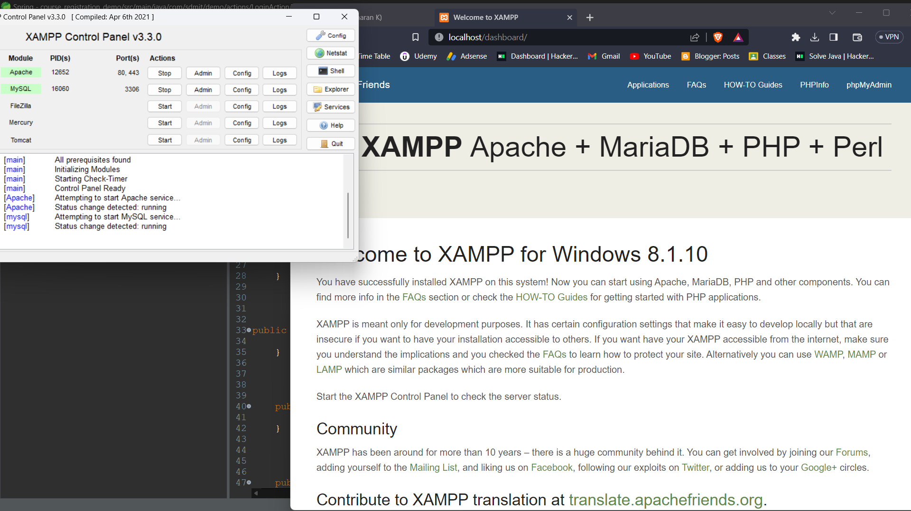

2. xampp sql database
      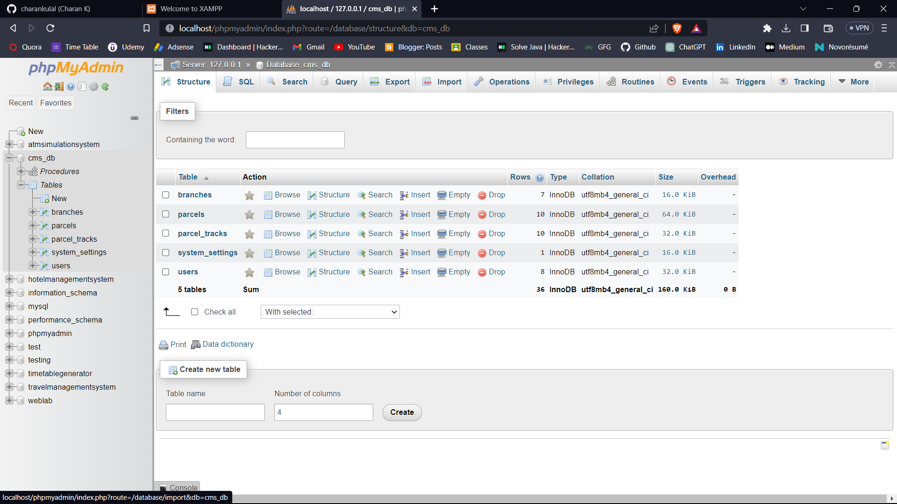

3. Login Page
      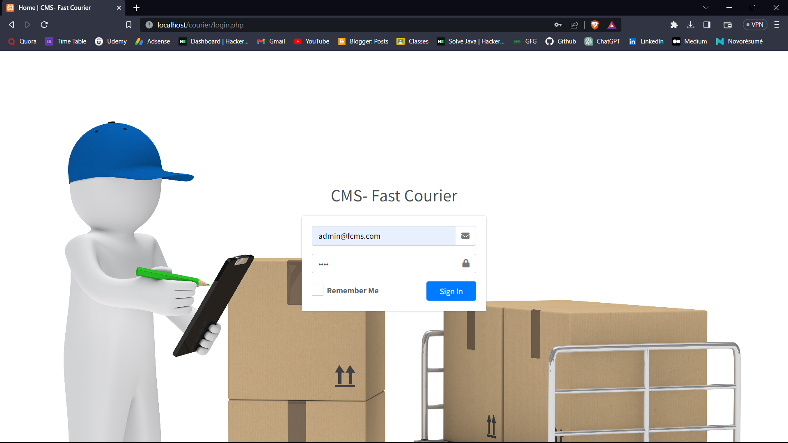

4. Admin Dashboard
       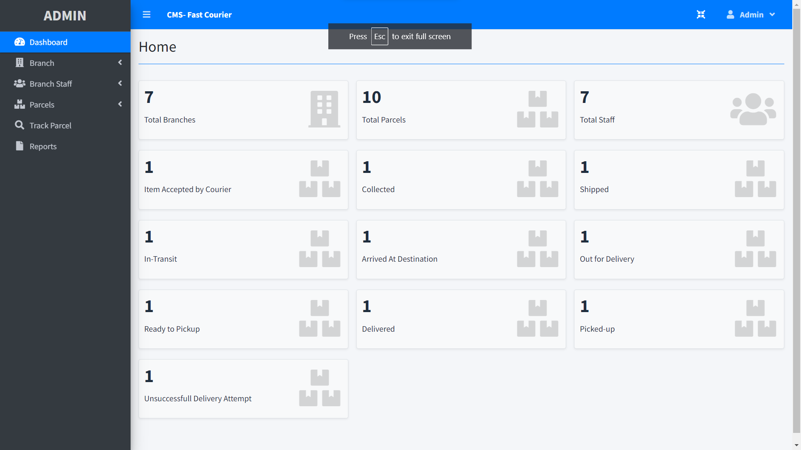

5. Add New Branch
       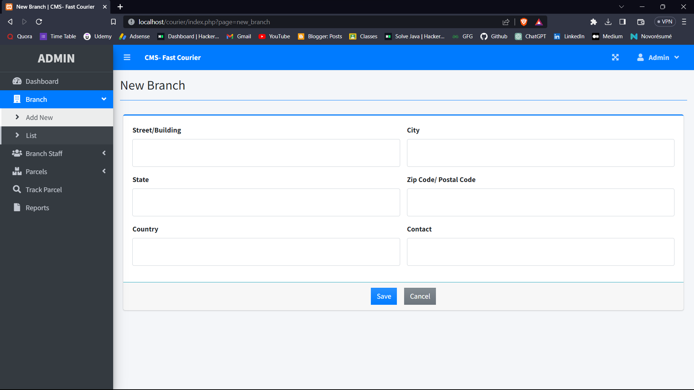

6. List All Branches
       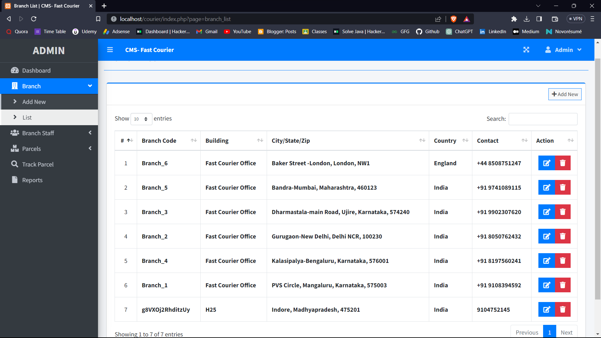

7. Edit Branch Details
       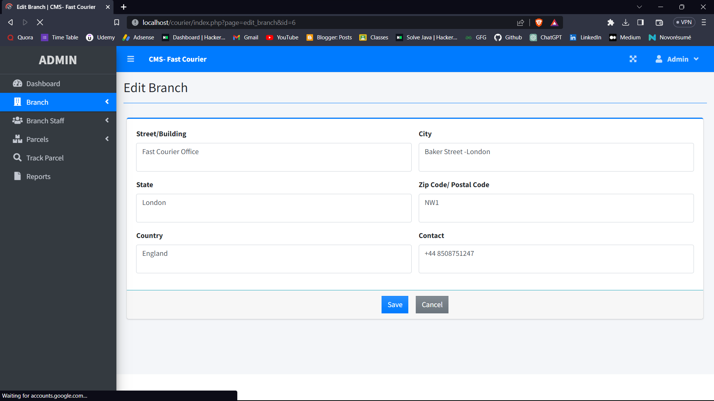

8. Add New Parcel
       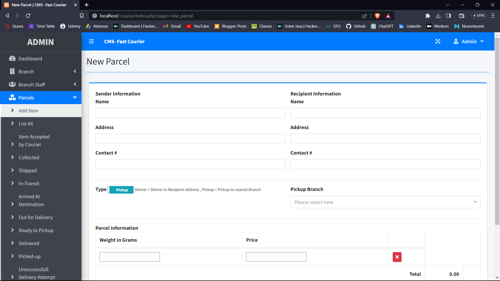

9. List All Parcels
       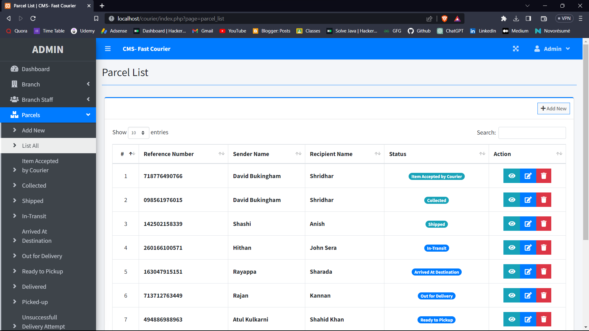

10. Add New Staff
       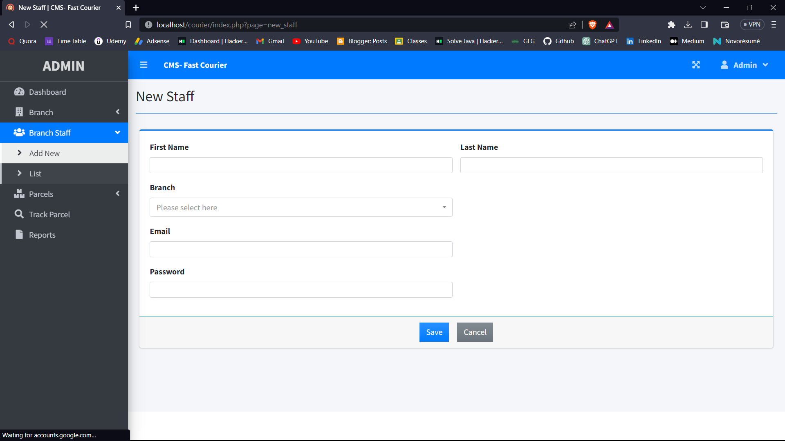

11. List All the Staffs
       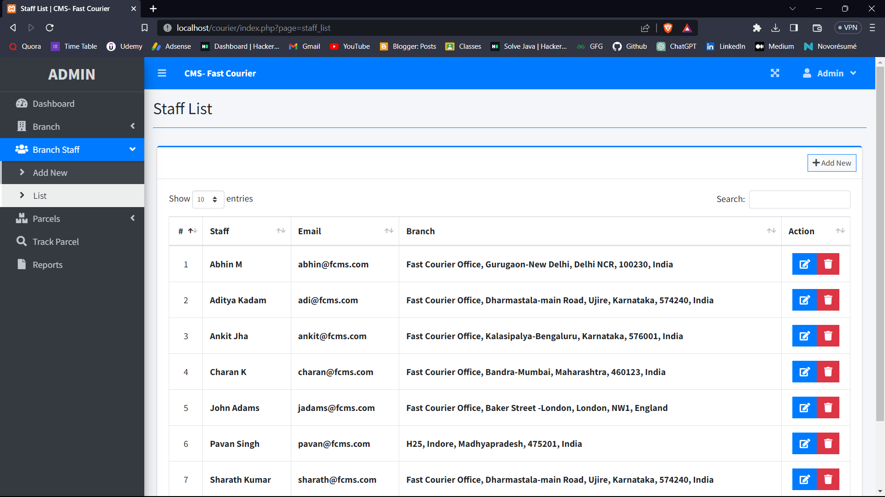

12. Edit staff Details
       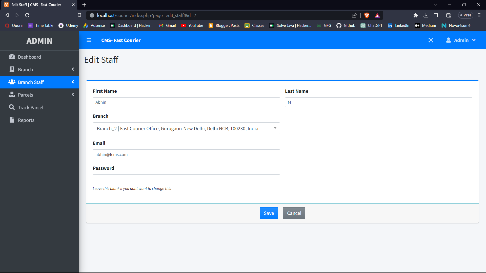

13. Track Parcels
       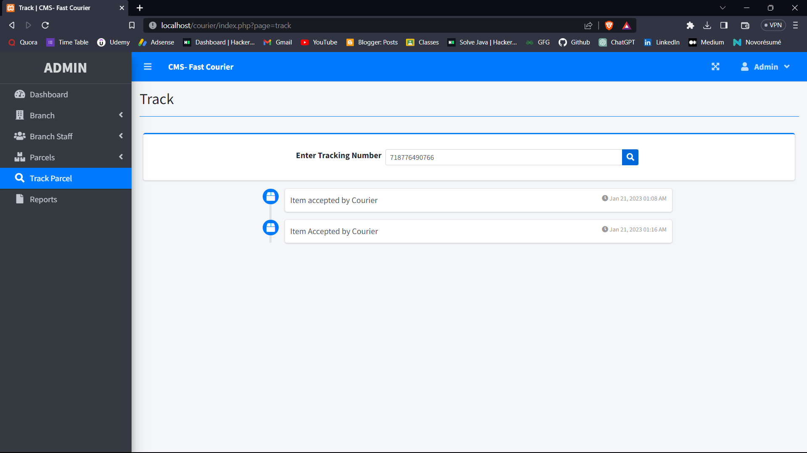

14. Report Page
       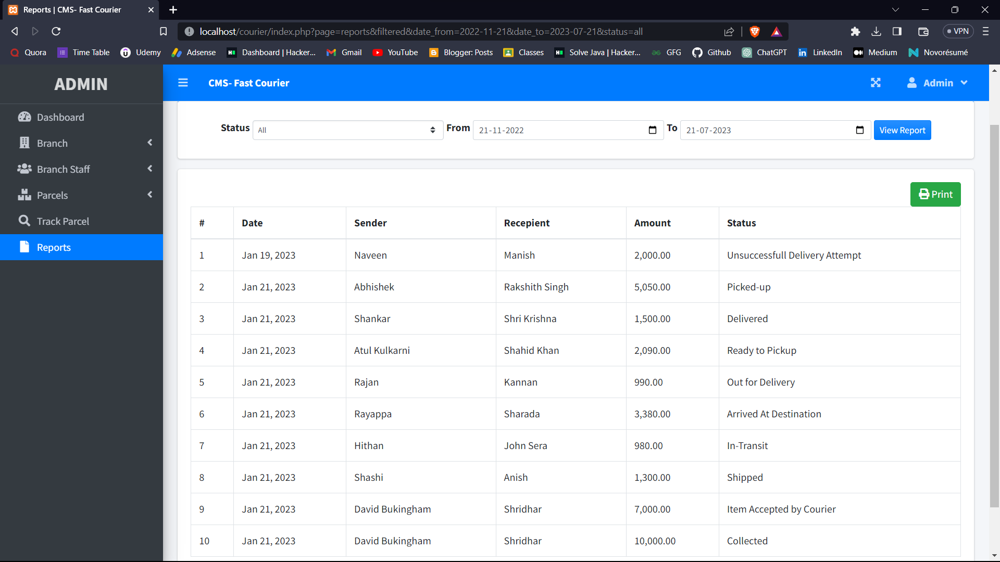   

15. Download or print the report
       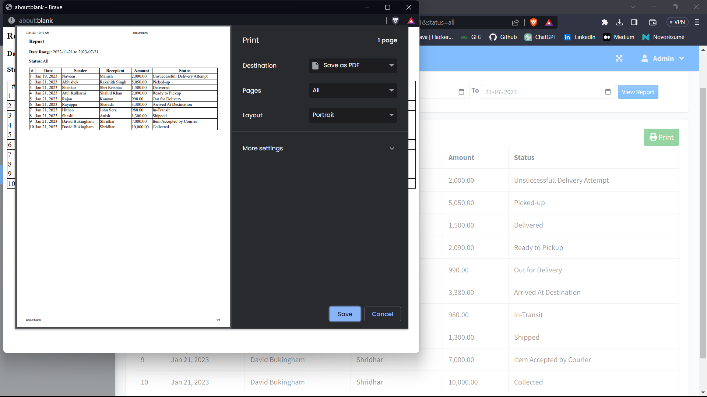

16. Employee Dashboard
       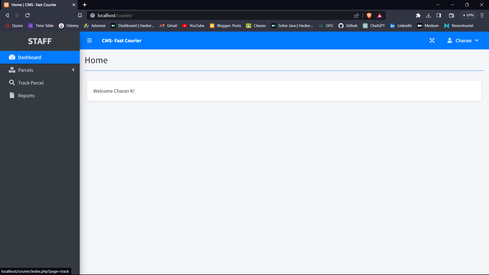

17. List of parcels in employee view
       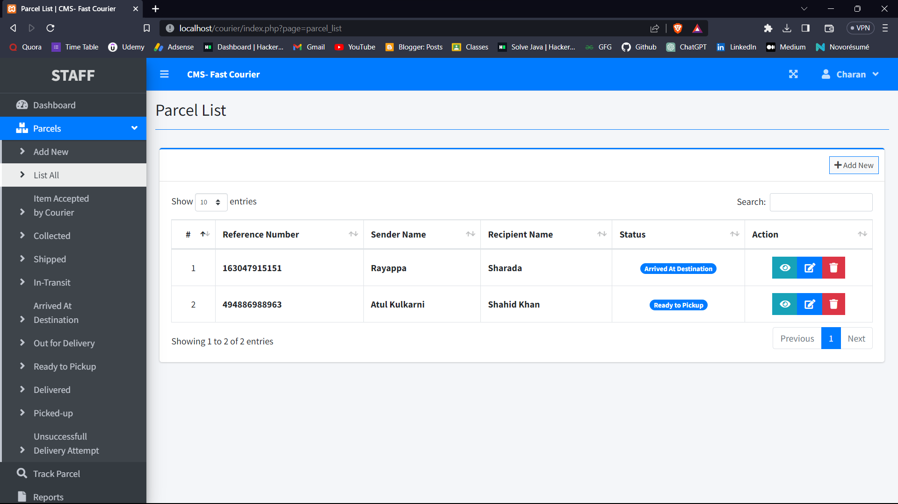

      